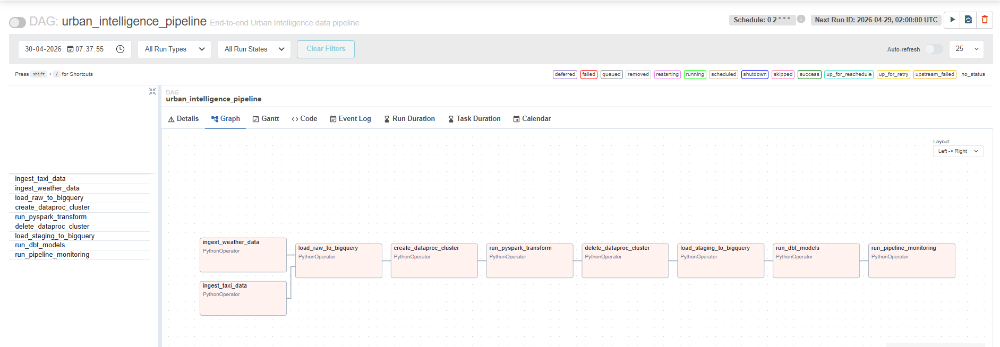
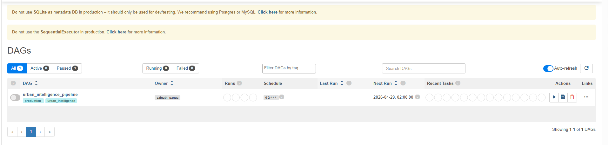
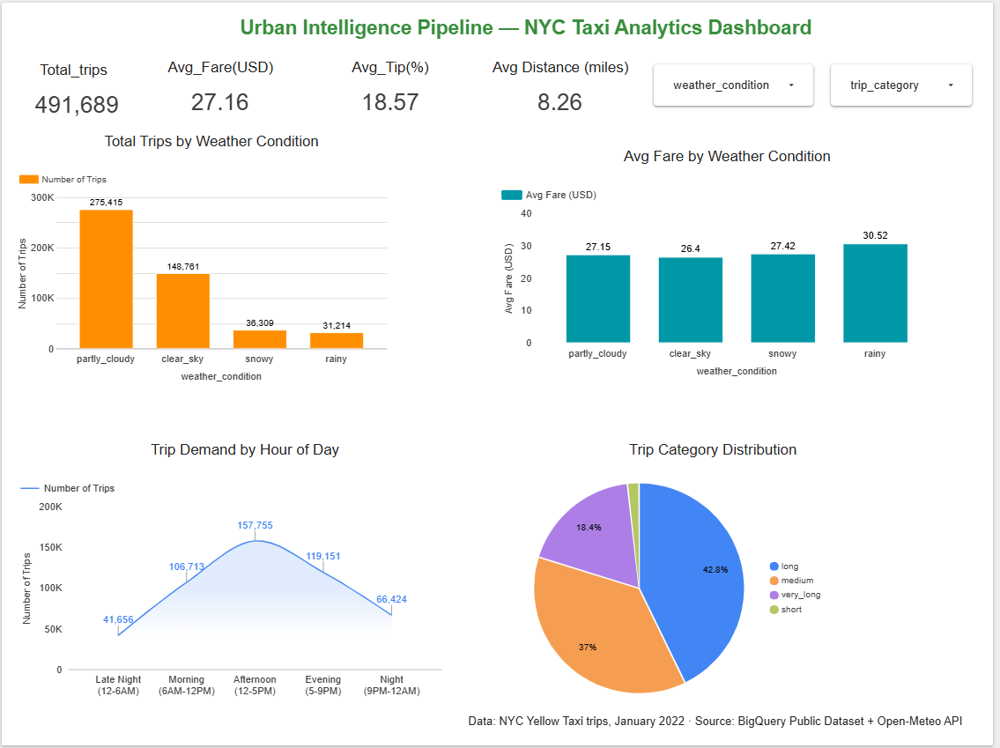

# 🏙️ Urban Intelligence Pipeline

> An end-to-end production-grade data engineering pipeline built on GCP — ingesting, transforming, modelling, orchestrating, and monitoring NYC taxi and weather data across a modern cloud-native stack.


---

## 📌 Project Overview

The Urban Intelligence Pipeline is a 7-day portfolio project that demonstrates production data engineering practices on Google Cloud Platform. It ingests 491,756 NYC Yellow Taxi trips alongside 744 hourly weather records, joins and transforms them using PySpark on Dataproc, models them with dbt into a star schema, orchestrates the full pipeline with Apache Airflow, monitors data quality automatically, and visualises insights in a Looker Studio dashboard.

**Key question answered:** *How does NYC weather affect taxi trip patterns, fares, and demand?*

**Key findings:**
- Rainy weather produces the highest average fares ($30.52 vs $26.40 on clear days)
- Afternoon (12-5PM) is peak demand with 157,755 trips — cold January drives daytime taxi use
- 42.8% of all trips are classified as long distance, dominant in winter months
- Partly cloudy conditions account for 275,415 trips (56% of total)

---

## 🏗️ Architecture

```
┌─────────────────────────────────────────────────────────────────────┐
│                         DATA SOURCES                                │
│   BigQuery Public Dataset            Open-Meteo API (Free)          │
│   NYC Yellow Taxi 2022               Hourly NYC Weather 2022        │
│   491,756 records                    744 hourly records             │
└──────────────┬───────────────────────────────┬──────────────────────┘
               │                               │
               ▼                               ▼
┌─────────────────────────────────────────────────────────────────────┐
│                      INGESTION LAYER                                │
│   taxi_ingestion.py        weather_ingestion.py                     │
│   pubsub_publisher.py (100 streaming events → Pub/Sub)              │
│              GCS Raw Bucket (Parquet, partitioned by date)          │
└──────────────────────────────┬──────────────────────────────────────┘
                               │
                               ▼
┌─────────────────────────────────────────────────────────────────────┐
│                   TRANSFORMATION LAYER                              │
│          PySpark on GCP Dataproc (2x n1-standard-2)                 │
│   taxi_weather_transform.py — join + enrich + feature engineering   │
│        GCS Staging Bucket → BigQuery staging dataset                │
│                    491,709 rows after join                          │
└──────────────────────────────┬──────────────────────────────────────┘
                               │
                               ▼
┌─────────────────────────────────────────────────────────────────────┐
│                    MODELLING LAYER (dbt)                            │
│   stg_taxi_trips (view) → fct_taxi_trips (491,709 rows)             │
│   dim_date · dim_location · 4 data quality tests (all passing)      │
│             BigQuery Marts Dataset (Star Schema)                    │
└──────────────────────────────┬──────────────────────────────────────┘
                               │
                               ▼
┌─────────────────────────────────────────────────────────────────────┐
│                 ORCHESTRATION LAYER (Airflow)                       │
│    9-task DAG · daily @ 02:00 UTC · parallel ingestion              │
│    ephemeral Dataproc cluster · dbt integration · monitoring        │
└──────────────────────────────┬──────────────────────────────────────┘
                               │
                               ▼
┌─────────────────────────────────────────────────────────────────────┐
│                     MONITORING LAYER                                │
│   Row count anomaly · Null rate checks · Weather data freshness     │
│             Email alerting · Airflow task integration               │
└──────────────────────────────┬──────────────────────────────────────┘
                               │
                               ▼
┌─────────────────────────────────────────────────────────────────────┐
│                   VISUALISATION LAYER                               │
│              Looker Studio — NYC Taxi Analytics Dashboard           │
│   4 KPI scorecards · 2 bar charts · 1 line chart · 1 pie chart     │
└─────────────────────────────────────────────────────────────────────┘
```

---

## 🛠️ Tech Stack

| Layer | Technology | Detail |
|---|---|---|
| Infrastructure | Terraform | 14 GCP resources provisioned via IaC |
| Storage | GCS (3 buckets) | Raw, staging, and scripts |
| Data Warehouse | BigQuery | Raw, staging, and marts datasets |
| Ingestion | Python + BigQuery SDK | Batch taxi + weather ingestion |
| Streaming | GCP Pub/Sub | Real-time ride event simulation (100 events) |
| Transformation | PySpark on Dataproc | Large-scale join and feature engineering |
| Modelling | dbt 1.7 + dbt_utils | Star schema + 4 data quality tests |
| Orchestration | Apache Airflow 2.10.3 | 9-task DAG with daily schedule |
| Monitoring | Python + BigQuery SDK | 3 anomaly checks + email alerts |
| CI/CD | GitHub Actions | 4-job pipeline — DAG, dbt, code quality |
| Visualisation | Looker Studio | 5-chart interactive dashboard |

---

## 📸 Screenshots

### Airflow DAG — Task Graph


### Airflow DAG — Pipeline View


### Looker Studio — NYC Taxi Analytics Dashboard


---

## 📁 Project Structure

```
urban-intelligence-pipeline/
├── terraform/                          # IaC — all GCP resources
│   ├── main.tf                         # Provider + 10 APIs enabled
│   ├── gcs.tf                          # 3 GCS buckets
│   ├── bigquery.tf                     # 3 BigQuery datasets
│   ├── iam.tf                          # Service account + 7 IAM roles
│   └── variables.tf
├── ingestion/
│   ├── batch/
│   │   ├── taxi_ingestion.py           # NYC taxi → GCS raw (491,756 rows)
│   │   ├── weather_ingestion.py        # Open-Meteo API → GCS raw (744 rows)
│   │   ├── load_to_bigquery.py         # GCS raw → BigQuery raw
│   │   └── load_staging_to_bigquery.py # GCS staging → BigQuery staging
│   └── streaming/
│       └── pubsub_publisher.py         # Synthetic ride events → Pub/Sub
├── transform/
│   └── dataproc/
│       └── taxi_weather_transform.py   # PySpark join + feature engineering
├── dbt/
│   └── urban_intelligence/
│       ├── models/
│       │   ├── staging/
│       │   │   ├── stg_taxi_trips.sql  # Staging view
│       │   │   └── sources.yml
│       │   └── marts/core/
│       │       ├── fct_taxi_trips.sql  # Fact table (491,709 rows)
│       │       ├── dim_date.sql        # Date dimension (2022 full year)
│       │       ├── dim_location.sql    # NYC taxi zone dimension
│       │       └── schema.yml          # 4 data quality tests
│       ├── dbt_project.yml
│       └── packages.yml                # dbt_utils 1.3.0
├── airflow/
│   └── dags/
│       └── urban_pipeline_dag.py       # 9-task orchestration DAG
├── monitoring/
│   ├── __init__.py
│   └── pipeline_monitor.py            # 3 anomaly checks + email alerts
├── .github/
│   └── workflows/
│       └── ci.yml                     # 4-job GitHub Actions CI pipeline
└── docs/
    └── ADR-001-platform-choices.md    # Architecture Decision Record
```

---

## 📅 Build Log — 7 Days

### Day 1 — GCP Foundation + Terraform IaC
Provisioned the entire GCP infrastructure using Terraform. Created the project `urban-intelligence-pipeline-sv` in `us-central1`, enabled 10 GCP APIs, and applied 14 Terraform resources including 3 GCS buckets, 3 BigQuery datasets, a dedicated service account with 7 IAM roles, and a remote Terraform state bucket. Wrote and committed ADR-001 documenting platform choices.

**Resources created:** `urban-intelligence-pipeline-sv-raw`, `urban-intelligence-pipeline-sv-staging`, `urban-intelligence-pipeline-sv-scripts` (GCS) + `raw`, `staging`, `marts` (BigQuery)

### Day 2 — Batch + Streaming Ingestion
Built three ingestion scripts. The taxi ingestion script pulls 500,000 records from the BigQuery public NYC taxi dataset (January 2022), cleans them to 491,756 rows across 27 columns, and lands the data in GCS as Parquet partitioned by ingestion date. The weather ingestion script fetches 744 hourly records from the Open-Meteo free API (no key required) for the same period. A Pub/Sub publisher simulates 100 real-time ride booking events to the `ride-events` topic.

**Key columns engineered:** `trip_duration_minutes`, `pickup_hour`, `day_of_week`, `weather_condition`, `is_raining`, `is_cold`, `temp_category`

### Day 3 — PySpark Transformation + BigQuery Loading
Loaded raw Parquet files into BigQuery (`taxi_raw`: 491,756 rows, `weather_raw`: 744 rows). Built a PySpark transformation job running on an ephemeral Dataproc cluster (2x n1-standard-2) that joins taxi and weather data on `trip_date + pickup_hour`, engineers derived features, and writes 491,709 rows to GCS staging (47 records dropped at date boundaries during weather join).

**Features engineered:** `fare_per_mile`, `tip_percentage`, `is_airport_trip`, `trip_category`, enriched weather columns

**Key insight:** Rainy cold trips averaged $36.46 fare vs $33.30 for partly cloudy cold conditions.

### Day 4 — dbt Models + Data Quality Tests
Set up dbt with BigQuery OAuth authentication. Built a full star schema with a staging view (`stg_taxi_trips`) that cleans and standardises the source data, a fact table (`fct_taxi_trips`: 491,709 rows, 143.9 MiB) with surrogate keys via `dbt_utils.generate_surrogate_key`, a date dimension covering all of 2022 via `dbt_utils.date_spine`, and a location dimension mapping NYC taxi zones. Wrote 4 data quality tests — all passing. Documented 20 known duplicate records in the NYC public source dataset.

**dbt models:** `stg_taxi_trips` (view) → `fct_taxi_trips` (table) + `dim_date` + `dim_location`

### Day 5 — Airflow Orchestration
Built a 9-task production DAG running daily at 02:00 UTC. Key design decisions: parallel ingestion for taxi and weather tasks, `trigger_rule=ALL_DONE` on cluster deletion to prevent orphaned billing clusters on Spark failure, `--profiles-dir` flag on all dbt commands, and dynamic path resolution for cross-platform compatibility. Deployed via Docker (`apache/airflow:2.10.3 standalone`) and verified in the Airflow UI with the full task graph visible.

**DAG flow:** `[ingest_taxi ‖ ingest_weather]` → `load_raw` → `create_cluster` → `pyspark` → `delete_cluster` → `load_staging` → `dbt` → `monitoring`

### Day 6 — Pipeline Monitoring + CI/CD
Built a monitoring module with 3 automated data quality checks: row count drop vs previous day (>20% threshold triggers alert), null rates across 7 key columns (>5% threshold), and weather data freshness (expects ≥20 hourly records). Anomalies trigger a formatted HTML email alert via SMTP and raise an Airflow task exception to fail the DAG run. Built a 4-job GitHub Actions CI pipeline (DAG validation, dbt tests, code quality with black + flake8, CI summary) — all jobs passing green.

### Day 7 — Looker Studio Dashboard
Built an interactive 5-chart analytics dashboard connected directly to `fct_taxi_trips` in BigQuery. Dashboard answers the core project question: how does weather affect NYC taxi demand and pricing?

---

## 📊 Dashboard

**Urban Intelligence Pipeline — NYC Taxi Analytics Dashboard**

https://datastudio.google.com/reporting/f0dd72e2-3555-44a7-b1c4-b5fe1deb507f

| KPI | Value |
|---|---|
| Total Trips | 491,689 |
| Avg Fare (USD) | $27.16 |
| Avg Tip % | 18.57% |
| Avg Distance | 8.26 miles |

**Charts:**
- Total Trips by Weather Condition — partly cloudy dominates (275,415 trips)
- Avg Fare by Weather Condition — rainy weather = highest fares ($30.52)
- Trip Demand by Hour of Day — afternoon peak at 157,755 trips
- Trip Category Distribution — 42.8% long trips in cold January

---

## 🗄️ BigQuery Tables

| Table | Type | Rows | Description |
|---|---|---|---|
| `raw.taxi_raw` | Table | 491,756 | Raw NYC taxi trips from public dataset |
| `raw.weather_raw` | Table | 744 | Hourly NYC weather from Open-Meteo |
| `staging.taxi_weather_staging` | Table | 491,709 | PySpark joined + enriched data |
| `raw_staging.stg_taxi_trips` | View | — | dbt staging model |
| `raw_marts.fct_taxi_trips` | Table | 491,709 | dbt fact table (star schema) |

---

## ☁️ GCP Resources

| Resource | Name |
|---|---|
| GCS Raw Bucket | `urban-intelligence-pipeline-sv-raw` |
| GCS Staging Bucket | `urban-intelligence-pipeline-sv-staging` |
| GCS Scripts Bucket | `urban-intelligence-pipeline-sv-scripts` |
| Terraform State | `urban-intelligence-tf-state-sv` |
| Dataproc Cluster | `urban-pipeline-cluster` (ephemeral) |
| Pub/Sub Topic | `ride-events` |
| GCP Project | `urban-intelligence-pipeline-sv` |
| Region | `us-central1` |

---

## 🔁 CI/CD Pipeline

Every push to `main` or `dev` triggers a 4-job GitHub Actions workflow:

| Job | What it checks |
|---|---|
| Validate Airflow DAG | Syntax check + DAG loads in Airflow without import errors |
| dbt Tests | `dbt compile` + `dbt test` against BigQuery |
| Code Quality | `black` formatting + `flake8` linting |
| CI Summary | Aggregates results from all 3 jobs |

---

## 🚀 Getting Started

### Prerequisites
- GCP account with billing enabled
- Terraform >= 1.0
- Python 3.11+
- Docker Desktop
- `gcloud` CLI authenticated

### 1. Clone the repository
```bash
git clone https://github.com/sainath7452/urban-intelligence-pipeline.git
cd urban-intelligence-pipeline
```

### 2. Provision GCP infrastructure
```bash
cd terraform
terraform init
terraform plan
terraform apply
```

### 3. Run ingestion
```bash
python ingestion/batch/taxi_ingestion.py
python ingestion/batch/weather_ingestion.py
python ingestion/batch/load_to_bigquery.py
```

### 4. Run PySpark transformation
```bash
# Upload script to GCS and submit to Dataproc
gsutil cp transform/dataproc/taxi_weather_transform.py gs://urban-intelligence-pipeline-sv-scripts/
gcloud dataproc jobs submit pyspark gs://urban-intelligence-pipeline-sv-scripts/taxi_weather_transform.py \
  --cluster=urban-pipeline-cluster --region=us-central1
```

### 5. Run dbt models
```bash
cd dbt/urban_intelligence
dbt run --profiles-dir ../
dbt test --profiles-dir ../
```

### 6. Start Airflow
```bash
docker run -p 8080:8080 \
  -v $(pwd)/airflow/dags:/opt/airflow/dags \
  -e AIRFLOW__CORE__LOAD_EXAMPLES=False \
  -e PYTHONWARNINGS=ignore \
  apache/airflow:2.10.3 standalone
```

---

## 📄 Architecture Decision Record

See [ADR-001 — Platform Choices](docs/ADR-001-platform-choices.md) for the rationale behind selecting GCP over AWS/Azure, dbt over custom SQL, and Airflow over Cloud Composer for local development.

---

## 👤 Author

**Sainath Panga**
Data Engineer | Azure · GCP · dbt · Spark · Airflow

[GitHub](https://github.com/sainath7452) · [LinkedIn](https://linkedin.com/in/sainath-panga)